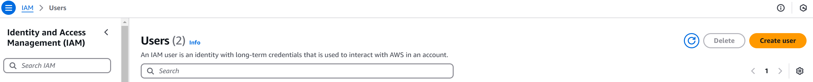
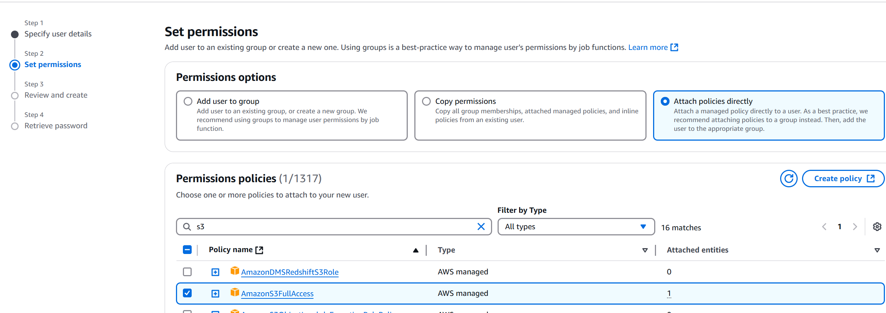
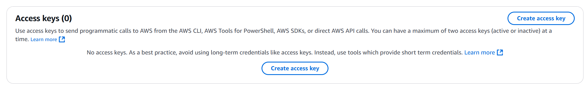
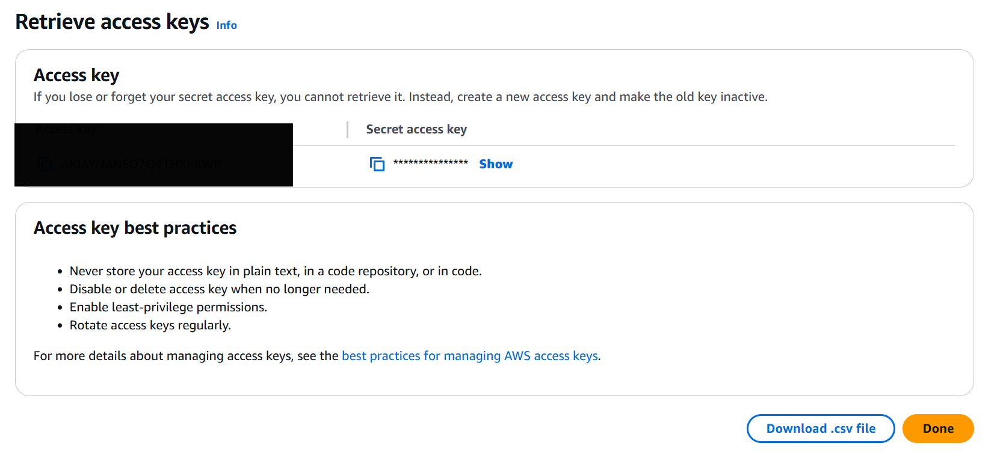
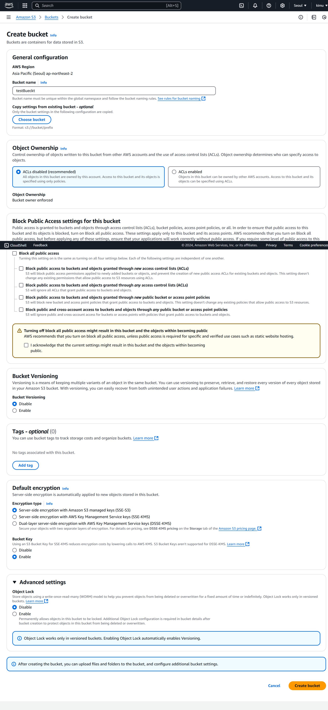
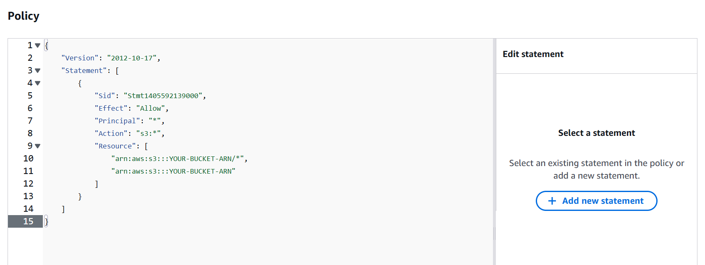

# SPRING - AWS S3 연동 방법

## 1. IAM 유저 추가


## 2. S3 권한 주기


## 3. 유저쪽 들어가서 Security credentials - Access keys - create keys - download .csv file



### 한번 발급하면 끝이니 꼭 다운로드

## 4. 버킷 생성


## 5. 버킷 설정 - permissions - bucket policy



```
{
	"Version": "2012-10-17",
	"Statement": [
		{
			"Sid": "Stmt1405592139000",
			"Effect": "Allow",
			"Principal": "*",
			"Action": "s3:*",
			"Resource": [
				"arn:aws:s3:::YOUR-BUCKET-ARN/*",
				"arn:aws:s3:::YOUR-BUCKET-ARN"
			]
		}
	]
}
```

## 6. application.properties 설정
```
spring.application.name=testImage

spring.profiles.include=s3
spring.servlet.multipart.max-file-size=10MB
spring.servlet.multipart.max-request-size=10MB
spring.cloud.aws.credentials.access-key=${AWS_IAM_ACCESS_KEY}
spring.cloud.aws.credentials.secret-key=${AWS_IAM_SECRET_KEY}
spring.cloud.aws.region.static=ap-northeast-2
spring.cloud.aws.s3.bucket=${AWS_S3_BUCKET_NAME}
```

## 7. application-s3.properties
csv 파일내 복사
```
AWS_IAM_ACCESS_KEY = your acces key
AWS_IAM_SECRET_KEY = your secret key
AWS_S3_BUCKET_NAME = bucketname
```

## 8. build.gradle 추가
    implementation 'org.springframework.cloud:spring-cloud-starter-aws:2.2.6.RELEASE'
